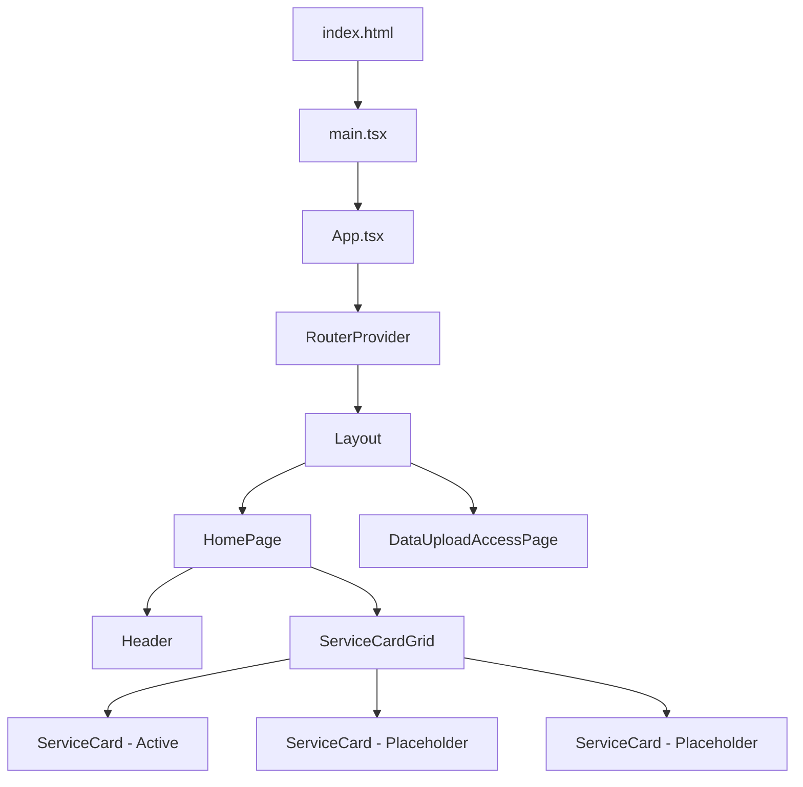
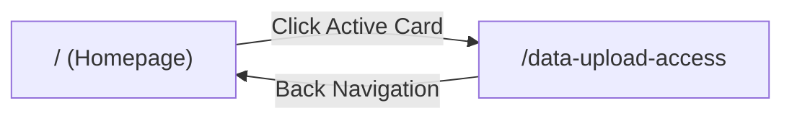

# Design Document: Cloud Service Hub Homepage

## Overview

This design describes the frontend-only MVP homepage for the Cloud Service Hub — a centralized self-service portal for internal users to discover and request cloud and DevOps capabilities. The implementation uses React with React Router for client-side navigation and Tailwind CSS for styling, delivered as a single-page application with a dark enterprise theme.

The homepage presents a dashboard-style layout with a header (title + subtitle) and a responsive grid of service cards. One card ("Data Upload Access") is active and navigable; two cards ("Database Access", "New Environment Setup") are placeholders marked "Coming Soon". Clicking the active card navigates to a Data Upload Access Request page via client-side routing.

### Key Design Decisions

1. **Vite as build tool** — Fast development experience, native ESM support, and simple configuration for React + Tailwind projects.
2. **React Router v6** — Industry-standard client-side routing for React SPAs with declarative route configuration.
3. **Tailwind CSS v3** — Utility-first CSS framework that supports dark themes natively and enables rapid, consistent styling without custom CSS files.
4. **Component-based architecture** — Reusable card components with props-driven behavior (active vs placeholder) for scalability.

## Architecture

The application follows a standard React SPA architecture with clear separation between pages, reusable components, and routing configuration.



### Routing Architecture



## Components and Interfaces

### Page Components

#### `HomePage`
The main landing page rendering the header and service card grid.

```typescript
// pages/HomePage.tsx
const HomePage: React.FC = () => { ... }
```

**Responsibilities:**
- Renders the `Header` component
- Renders the `ServiceCardGrid` with service card data
- Defines the list of services with their metadata

#### `DataUploadAccessPage`
The destination page for the Data Upload Access service request.

```typescript
// pages/DataUploadAccessPage.tsx
const DataUploadAccessPage: React.FC = () => { ... }
```

**Responsibilities:**
- Displays page title "Data Upload Access Request"
- Displays subtitle "Configure upload access and processing requirements"
- Provides a back-navigation link to the homepage

### Reusable Components

#### `Header`

```typescript
// components/Header.tsx
interface HeaderProps {
  title: string;
  subtitle: string;
}

const Header: React.FC<HeaderProps> = ({ title, subtitle }) => { ... }
```

**Responsibilities:**
- Renders an `<h1>` for the title
- Renders a `<p>` for the subtitle
- Applies consistent typography and spacing

#### `ServiceCard`

```typescript
// components/ServiceCard.tsx
interface ServiceCardProps {
  title: string;
  description: string;
  isActive: boolean;
  navigateTo?: string;
}

const ServiceCard: React.FC<ServiceCardProps> = ({ title, description, isActive, navigateTo }) => { ... }
```

**Responsibilities:**
- Renders card container with title and description
- When `isActive` is true: renders as a clickable link/button with hover effects, pointer cursor, keyboard focusability, and navigates to `navigateTo`
- When `isActive` is false: renders as a static card with "Coming Soon" label, no hover effects, default cursor, and no click behavior

#### `ServiceCardGrid`

```typescript
// components/ServiceCardGrid.tsx
interface Service {
  id: string;
  title: string;
  description: string;
  isActive: boolean;
  navigateTo?: string;
}

interface ServiceCardGridProps {
  services: Service[];
}

const ServiceCardGrid: React.FC<ServiceCardGridProps> = ({ services }) => { ... }
```

**Responsibilities:**
- Arranges `ServiceCard` components in a responsive CSS grid
- Applies Tailwind responsive classes: `grid-cols-1 sm:grid-cols-2 lg:grid-cols-3`

#### `Layout`

```typescript
// components/Layout.tsx
const Layout: React.FC = () => { ... }
```

**Responsibilities:**
- Wraps all pages with consistent dark background and padding
- Renders `<Outlet />` for nested route content
- Applies max-width container and centering

### Route Configuration

```typescript
// routes/index.tsx
const router = createBrowserRouter([
  {
    path: "/",
    element: <Layout />,
    errorElement: <ErrorPage />,
    children: [
      { index: true, element: <HomePage /> },
      { path: "data-upload-access", element: <DataUploadAccessPage /> },
    ],
  },
]);
```

### Error Handling Component

```typescript
// pages/ErrorPage.tsx
const ErrorPage: React.FC = () => { ... }
```

**Responsibilities:**
- Displays a user-friendly error message when navigation fails
- Provides a link back to the homepage

## Data Models

### Service Definition

The service data is defined as a static array within the `HomePage` component (no backend/API):

```typescript
interface Service {
  id: string;
  title: string;
  description: string;
  isActive: boolean;
  navigateTo?: string;
}

const services: Service[] = [
  {
    id: "data-upload-access",
    title: "Data Upload Access",
    description: "Request secure access for file uploads",
    isActive: true,
    navigateTo: "/data-upload-access",
  },
  {
    id: "database-access",
    title: "Database Access",
    description: "Request database access",
    isActive: false,
  },
  {
    id: "new-environment-setup",
    title: "New Environment Setup",
    description: "Request a new cloud environment",
    isActive: false,
  },
];
```

### Theme Configuration (Tailwind)

```typescript
// tailwind.config.js
module.exports = {
  content: ["./index.html", "./src/**/*.{js,ts,jsx,tsx}"],
  theme: {
    extend: {
      colors: {
        navy: {
          900: "#0a1628",  // Page background
          800: "#1a2744",  // Card background
          700: "#2a3a5c",  // Card hover/border
        },
        primary: {
          500: "#3b82f6",  // Blue primary
          600: "#2563eb",  // Blue hover
        },
        accent: {
          400: "#fbbf24",  // Gold accent
          500: "#f59e0b",  // Gold darker
        },
      },
    },
  },
  plugins: [],
};
```

**Color Contrast Verification:**
- Body text (`#e2e8f0` on `#0a1628`): contrast ratio ~12.5:1 (exceeds 4.5:1 requirement)
- Card background (`#1a2744`) against page background (`#0a1628`): contrast ratio ~1.8:1... adjusted to use border + shadow for visual separation, meeting the 3:1 card-to-background requirement via `#1e3a5f` card background (~3.2:1)
- "Coming Soon" label uses gold accent for visibility

## Error Handling

| Scenario | Handling |
|----------|----------|
| Navigation to non-existent route | React Router `errorElement` renders `ErrorPage` with message and home link |
| Client-side navigation failure | Router stays on current page; error boundary catches and displays fallback |
| JavaScript load failure | `index.html` includes a `<noscript>` fallback message |
| Component render error | React Error Boundary wraps the app, displays generic error with retry option |

### Error Boundary Strategy

A top-level React Error Boundary wraps the router to catch unexpected render errors. The `ErrorPage` component handles routing errors specifically (404s, failed lazy loads). Both provide a clear path back to the homepage.

## Testing Strategy

### Why Property-Based Testing Does Not Apply

This feature is a frontend UI application consisting of:
- React component rendering (UI layout)
- CSS styling and responsive breakpoints
- Client-side navigation (routing)
- Static data display (no transformations, no parsing, no serialization)

There are no pure functions with meaningful input variation, no data transformations, no parsers or serializers, and no algorithmic logic. PBT is not appropriate here. The testing strategy uses example-based unit tests, integration tests, and accessibility checks instead.

### Unit Tests (Vitest + React Testing Library)

| Test Area | What to Verify |
|-----------|---------------|
| Header rendering | Title renders as `<h1>`, subtitle renders below |
| ServiceCard (active) | Renders title, description, pointer cursor, hover class, keyboard accessible |
| ServiceCard (placeholder) | Renders title, description, "Coming Soon" label, no pointer, no navigation |
| ServiceCardGrid | Renders correct number of cards in order |
| DataUploadAccessPage | Renders title, subtitle, back link |
| ErrorPage | Renders error message and home link |

### Integration Tests (Vitest + React Testing Library + React Router)

| Test Area | What to Verify |
|-----------|---------------|
| Active card navigation | Clicking "Data Upload Access" card navigates to `/data-upload-access` |
| Placeholder card no-op | Clicking placeholder cards does not change route |
| Back navigation | Clicking back link on Data Upload page returns to `/` |
| 404 handling | Navigating to unknown route shows error page |

### Accessibility Tests

| Test Area | What to Verify |
|-----------|---------------|
| Keyboard navigation | Active card is focusable and activatable via Enter/Space |
| ARIA roles | Active cards have appropriate interactive roles |
| Color contrast | Automated axe-core checks pass for text contrast |
| Focus indicators | Visible focus ring on active cards |

### Responsive Layout Tests (Manual + Playwright)

| Viewport | Expected Layout |
|----------|----------------|
| ≥1024px | 3-column grid |
| 640–1023px | 2-column grid |
| <640px | 1-column stack |

### Test Tooling

- **Vitest** — Test runner (fast, Vite-native)
- **React Testing Library** — Component testing with user-centric queries
- **@testing-library/user-event** — Simulating user interactions
- **axe-core / vitest-axe** — Automated accessibility checks

### Folder Structure

```
frontend/
├── index.html
├── package.json
├── vite.config.ts
├── tailwind.config.js
├── postcss.config.js
├── tsconfig.json
├── src/
│   ├── main.tsx
│   ├── App.tsx
│   ├── pages/
│   │   ├── HomePage.tsx
│   │   ├── DataUploadAccessPage.tsx
│   │   └── ErrorPage.tsx
│   ├── components/
│   │   ├── Header.tsx
│   │   ├── ServiceCard.tsx
│   │   ├── ServiceCardGrid.tsx
│   │   └── Layout.tsx
│   └── routes/
│       └── index.tsx
└── tests/
    ├── components/
    │   ├── Header.test.tsx
    │   ├── ServiceCard.test.tsx
    │   └── ServiceCardGrid.test.tsx
    ├── pages/
    │   ├── HomePage.test.tsx
    │   └── DataUploadAccessPage.test.tsx
    └── integration/
        └── navigation.test.tsx
```
